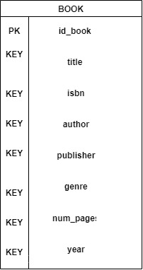
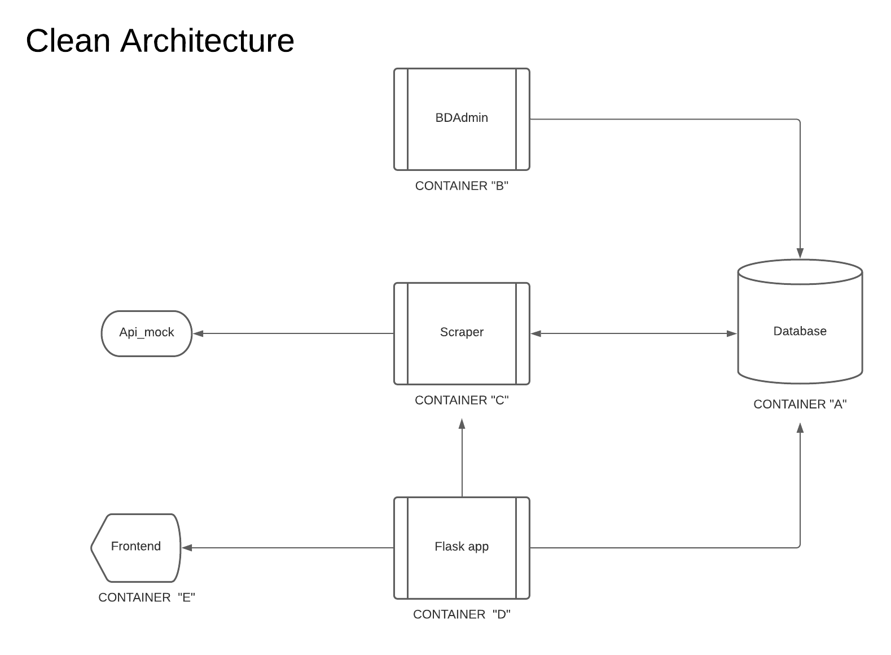

#  Clean Architecture   - Equipo 3

# Equipo

* Jose Jahir Pérez Sánchez
* Fernando Flores Fernández
* Luis Enrique Cázares Martínez
* Gonzalo De Jesús Garcia Sánchez

## Tema

* Clean Architecture: 
    - [Clean Architecture](Clean_architecture.md)

## Diagramas
- Base de datos:
    - 

- Diagrama de arquitectura:
    - 

### Desarrollo

Crear un archivo `docker-compose.yml` por medio del cual se instancien **4** contenedores:

#### Contenedor A - DB
* Se encargará de correr un servidor de base de datos en alguno de los motores de base de datos que se revisaron en clase, es decir, se puede elegir entre PostgreSQL, MySQL, MongoDB y Redis. Esta base de datos almacenará la información de nuestra aplicación en general
* La base de datos debe de tener persistencia habilitada, es decir, no importa cuantas veces iniciemos o detengamos nuestro container de base de datos, incluso si lo removemos, los datos que previamente almacenamos estarán disponible en el host/equipo local. Recuerda usar volúmenes para lograr esto.

#### Contenedor B - DBMS/DBAdmin
* Se encargará de ejecutar alguno de los DBMS que vimos en clase, dependiendo del motor de base de datos elegido. También es posible investigar e implementar algún otro DBMS que funcione sobre Docker y que sea más sencillo y/o a gusto del equipo
* Este contenedor se conectará con la base de datos del contenedor A de tal manera que podamos visualizar el esquema de datos creado para este proyecto

#### Contenedor C - Scraper or Generator
* Este contenedor se encargará de correr un script que popule la base de datos del contenedor A con los datos que deberán de mostrarse a través de la API del contenedor D
* Los datos que tienen que generarse deben de girar en torno a una librería. Es decir que deberás de utilizar los respectivo modelos y/o entidades necesarios para representar un registro en la base de datos, por ejemplo: libros, autores, editoriales, etcétera
* Este contenedor en especifico y su lógica de negocio quedan a la creatividad e imaginación de cada equipo (y esto se tomará en cuenta para la evaluación), pero como tip puedes generar los datos a través de alguna librería para generar datos falsos, o bien obtenerlos de alguna API/DB pública (aquí hay un listado de referencia)

#### Contenedor D - API
* Para esta parte puedes utilizar Flask o cualquier otro framework MVC como Django por ejemplo. Incluso puedes desarrollarlo "from scratch" (desde 0) si lo consideras pertinente y necesario
* Este contenedor estará a cargo de ejecutar una pequeña "web-app" que muestre un listado de todos los libros y de las otras entidades de la librería que hayas agregado o generado por medio del contenedor C en formato JSON
* Para cada uno de los endpoints/recursos que hayas agregado, habilita las operaciones CRUD por medio del mismo endpoint, es decir, ser capaz de hacer un request de tipo HTTP - POST a esa ruta a través de nuestro API, de tal manera que alguien que consuma la "web-app" también pueda crear registros por medio de la misma. Puedes revisar los laboratorios 11 y 12 del repositorio de docker-workshop como referencia a este punto en específico. Asegúrate de que para cada endpoint/recurso se pasen todos los datos necesarios para poder llevar a cabo operaciones CRUD en la BD con éxito. Recuerda que puedes hacer pruebas para este punto en específico con algunas herramientas gratuitas como Postman o Insomnia

#### Contenedor E - Frontend
* Agregar un contenedor extra E con un frontend (GUI) que consuma la API del contenedor D. Acá puedes utilizar tecnologías como HTML, CSS, Javascript, Bootstrap, Vue, Angular o ReactJS para hacer más rápido este proceso
* Queda a tu criterio, imaginación y creatividad el cómo luzca la interfaz final

## Instruccio es de uso 

* Primero clonaremos el repositorio de git
* Inicializamos el `docker-compose.yml con el comando docker compose up -d --build` desde la terminal lo primero que se hace internamente es crear la base de datos llamada book (contenedor-A).
* Despues se crea un DBMS, este segundo contenedor (contenedor-B) se conectará con la base de datos del contenedor-A de tal manera que podamos visualizar el esquema de datos creado. 
* Despues se crearan datos falsos (contenedor-C) en un archivo Json y con un script de python que agregara los datos del scrip de Json a la base de datos.
* Tambien se crea una API (contenedor-D) que esta muestra desde 1 solo libro hasta todos los libros de la base de datos, tambien permite crear, actualizar y borrar un libro de a base de datos
* Despues el usuario ira a la ruta `localhost:5001` para asi interactuar con el comntenedor-E y poder ver en la `pagina` los libros ya sea que sean buscados por `ID` o bien que se muestren todos los libros alojados en la base de datos
